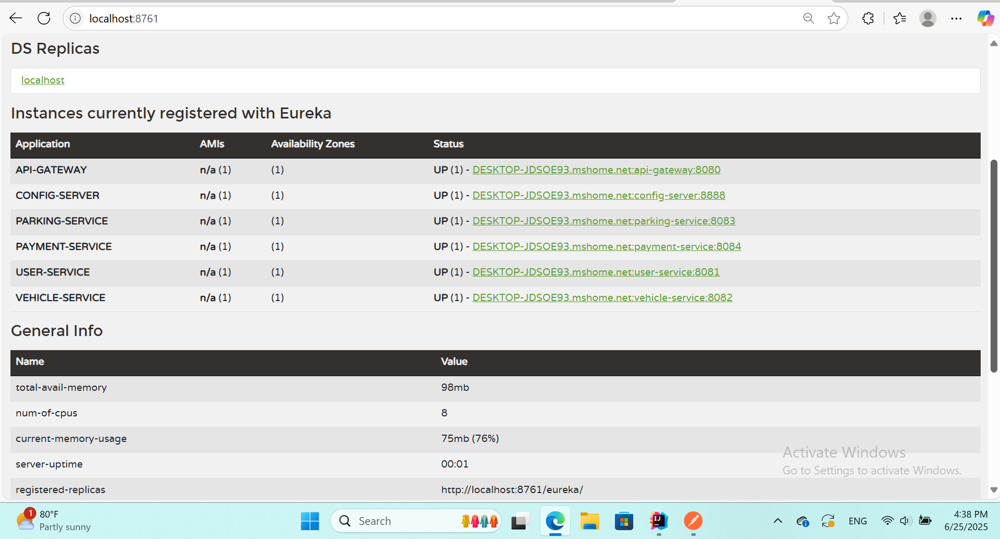

# 🚗 Smart Parking Management System

## 📁 Resources

🧪 [Postman Collection](./Smart-Parking-System.postman_collection.json)

🖥️Eureka Dashboard Screenshot 

## 📌 Introduction

The **Smart Parking Management System (SPMS)** is a cloud-native, microservices-based system built using the Spring ecosystem. It is designed to automate and simplify parking space reservation and management. This repository contains the **User Service**, which is responsible for handling user registration, authentication using JWT, and managing user data securely.

## 🧱 System Architecture

This project follows the **Microservices Architecture** with Spring Cloud. Each service runs independently and registers to the Eureka Service Registry.

### 🧩 Services Overview

| Service Name         | Description                                                              |
|----------------------|---------------------------------------------------------------------------|
| 🧑‍💼 `user-service`       | Manages user registration, login, JWT authentication, and user profiles |
| 🚗 `vehicle-service`    | Handles vehicle data linked to users, including registration numbers     |
| 🅿️ `parking-service`    | Manages parking slots, availability, booking logic, and time tracking    |
| 💳 `payment-service`    | Manages payments, card info, invoices, and payment confirmations         |
| 🌐 `api-gateway`        | Acts as the single entry point; routes requests to correct services       |
| 🔍 `eureka-server`      | Service registry where all services register and discover each other     |
| ⚙️ `config-server`      | Centralized configuration for all microservices using GitHub repo 

## ⚙️ Technologies Used

- Java 17
- Spring Boot 3.x
- Spring Cloud (Eureka, Config Server, Gateway)
- Spring Security + JWT
- MySQL
- Maven
- Postman (API Testing)
- GitHub for version control

